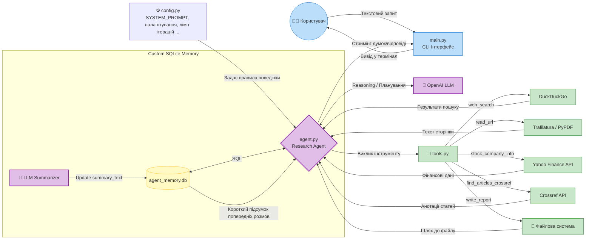
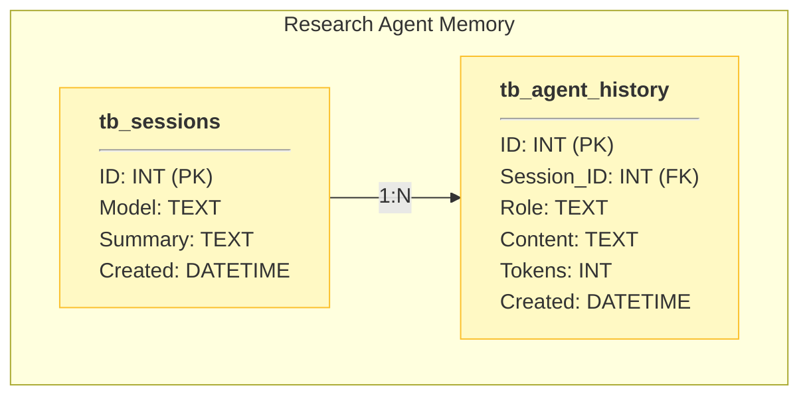

# Завдання: Research Agent з власним ReAct Loop


### Що змінилося порівняно з homework-lesson-3
| homework-lesson-3 | homework-lesson-4 |
|---|---|
| LangChain | Власна реалізація |
| `MemorySaver` для памʼяті | Список `messages` (для поточної сесії пам'ятає max_steps_to_remember (config.py) останніх кроків + перше повідомлення) |
| Памя'ять між різними сесіями відсутня | БД на SQLite з summary та повними логами попередніх розмов, для попередніх 5 розмов передаємо коротке summary з БД |
| `@tool` декоратор LangChain | Tools описані як JSON Schema для API |
| Базовий system prompt | Покращений prompt із застосуванням технік промптингу |
|-|Користувач може видалити збережені дані про попередні розмови (delete history)|

### Приклад:


Приклади згенерованих звітів - в [output](/homework-lesson-4/output)

### Загальний опис

Агент запускається з терміналу (python3 main.py) та працює в інтерактивному режимі — користувач вводить запитання, отримує відповідь, і може продовжити діалог.
Агент підтримує зв'язний діалог — пам'ятає попередні повідомлення в межах сесії.

Для коректної роботи потрібен [API-ключ OpenAI](https://platform.openai.com/) та створений файл .env з вказаним ключем: `OPENAI_API_KEY=<тут_ваш_ключ>`

Файл залежностей — [requirements.txt](https://github.com/viktor-taraba/MULTI-AGENT-SYSTEMS-course/blob/main/homework-lesson-4/requirements.txt), встановлення необхідних бібліотек `python3 -m pip install -r requirements.txt`

При підрізці messages враховуємо послідовність ResponseReasoningItem -> ResponseFunctionToolCall -> function_call_output. Рекомендується задавати значення max_steps_to_remember з розрахунком на максимально можливу тривалість діалогу, тобто таким чином, щоб воно було не менше за 2+(max_iterations+1)*3 (перше повідомлення з системним повідомленням + запит користувача + максимальна кількість ітерацій + додаткова ітерація на формування звіту).

Приклад кроків при розрахунку к-ті повідомлень для пам'яті:
```
 ResponseReasoningItem(
        id="rs_01524c199f411aad0069bfe24771848191b6a8b30304df4eac",
        summary=[],
        type="reasoning",
        content=None,
        encrypted_content=None,
        status=None,
    ),
ResponseFunctionToolCall(
        arguments='{"query":"BERT 2018 arXiv \'BERT: Pre-training of Deep Bidirectional Transformers\' pdf"}',
        call_id="call_lZfO3ET79puJhldRPp5i2hy4",
        name="web_search",
        type="function_call",
        id="fc_01524c199f411aad0069bfe247bebc81918e38e7dddb7991d8",
        namespace=None,
        status="completed",
    ),
    {
        "type": "function_call_output",
        "call_id": "call_lZfO3ET79puJhldRPp5i2hy4",
        "output": '"[{\\"title\\": \\"[1810.04805] BERT: Pre-training of Deep Bidirectional\\", \\"url\\": \\"https://arxiv.org/abs/1810.04805\\", \\"snippet\\": \\"View aPDFofthe paper titledBERT:Pre-trainingofDeepBidirectionalTransformersfor Language Understanding, by Jacob Devlin and 3 other authors\\"}, {\\"title\\": \\"Toward structuring real-world data: Deep learning for\\", \\"url\\": \\"https://www.cell.com/patterns/fulltext/S2666-3899(23)00066-1\\", \\"snippet\\": \\"... in medical registries, which are often readily available and capture patient information, as the basis for patient-level supervision totraindeep...\\"}, {\\"title\\": \\"BERT (Language Model)\\", \\"url\\": \\"https://devopedia.org/bert-language-model\\", \\"snippet\\": \\"...pdfRedirected URLs: Discussion: https://arxiv.org/pdf/1810.04805.pdf\\\\u2192 http://arxiv.org/pdf/1810.04805 Discussion: ...\\"}, {\\"title\\": \\"Application and Effectiveness of BERT in Question and Answer\\", \\"url\\": \\"https://www.itm-conferences.org/articles/itmconf/ref/2025/04/itmconf_iwadi2024_02007/itmconf_iwadi2024_02007.html\\", \\"snippet\\": \\"Devlin,BERT:Pre-trainingofdeepbidirectionaltransformersfor language understanding. ...BidirectionalEncoder Representations fromTransformers...\\"}, {\\"title\\": \\"Chapter | Papers We Love\\", \\"url\\": \\"https://paperswelove.org/chapter/toronto/\\", \\"snippet\\": \\"Arun Raja will be presenting \\\\u201cBERT:Pre-trainingofDeepBidirectionalTransformersfor Language Understanding\\\\u201d by Jacob Devlin, et al.\\"}, {\\"title\\": \\"Themen\\", \\"url\\": \\"https://www.mnm-team.org/teaching/Seminare/2022ws/Hauptseminar/Themen.html\\", \\"snippet\\": \\"Devlin et al.,BERT:Pre-trainingofDeepBidirectionalTransformersfor Language Understanding , 2019 ... Latent Diffusion Models, https://arxiv...\\"}, {\\"title\\": \\"Themen\\", \\"url\\": \\"https://www.mnm-team.org/teaching/Seminare/2022ws/Hauptseminar/Themen/\\", \\"snippet\\": \\"Devlin et al.,BERT:Pre-trainingofDeepBidirectionalTransformersfor Language Understanding , 2019 ... Latent Diffusion Models, https://arxiv...\\"}]"',
    },
```

### Опис тулів для агента:
|Назва|Параметри|Опис|
|--|--|--|
|`web_search`|`query: str`|Шукає актуальну інформацію в інтернеті через DuckDuckGo. Повертає перелік знайдених посилань з даними про заголовок, URL, фрагмент тексту. Використовується як перший крок пошуку.|
|`read_url`|`url: str`|Отримує основний текст із вебсторінки (або PDF, якщо це пряме посилання на pdf-звіт чи статтю).|
|`stock_company_info`|`stock_ticker: str, result_type: str`|Отримує фінансові дані або загальний профіль компанії через Yahoo Finance API.|
|`find_articles_crossref`|`query: str`|Шукає наукові статті в базі Crossref. Повертає відфільтрований список записів із валідною анотацією (назва, анотація, DOI, рік).|
|`write_report`|`filename: str, content: str`|Зберігає фінальний звіт у форматі Markdown, використовується як останній крок для видачі результату.|

### Структура проєкту

```
homework-lesson-4/
├── main.py              # Entry point
├── agent.py             # Agent setup (LLM, tools, memory, create_agent)
├── tools.py             # Tool definitions and implementations
├── config.py            # System prompt, settings, constants
├── agent_memory.db      # SQLite database for cross-sesion memory and logging
├── requirements.txt     # Libraries list + min version for each library
├── output/
│   └── context_window_agentic_systems_comparison.md   # Example generated report (#1)
│   └── dividend_policy_literature.md                  # Example generated report (#2)
│   └── news_ukraine_last_week_14-21_Mar_2026.md       # Example generated report (#3)
│   └── superortikon_report.md                         # Example generated report (#4)
│   └── test_finans_2kurs.md                           # Example generated report (#5)
└── README.md            # Setup instructions, architecture overview
```

### Блок-схема роботи агента



### Схема даних (SQLite)



---

Приклад логу в консолі:
```
Research Agent
type 'exit' or 'quit' to quit
'delete history' to delete full conversation history (including previous conversations) and exit
----------------------------------------------------------------------------------------------------

You: compare available databases for RAG for custom llm agent

🔄 Iteration 1 - Thinking...
🔧 Tool called -> web_search({'query': 'vector database comparison RAG Pinecone Weaviate Milvus Qdrant Chroma FAISS Redis compari...)
✅ Result (web_search): [{"title": "Vector Stores for RAG Comparison - Rost Glukhov | Personal ...", "url": "https://www.glu...

🔄 Iteration 2 - Thinking...
🔧 Tool called -> read_url({'url': 'https://www.glukhov.org/rag/vector-stores/vector-stores-for-rag-comparison/'})
✅ Result (read_url): Vector Stores for RAG Comparison
Pick the right vector DB for your RAG stack
Choosing the right vect...

🔄 Iteration 3 - Thinking...
🔧 Tool called -> read_url({'url': 'https://jishulabs.com/blog/vector-database-comparison-2026'})
✅ Result (read_url): Vector databases have become essential infrastructure for AI applications, powering everything from ...

🔄 Iteration 4 - Thinking...
🔧 Tool called -> write_report({'filename': 'rag_vector_db_comparison.md', 'content': '# Comparative Guide: Vector Databases for RA...)
✅ Result (write_report): Success: Report successfully saved to C:\Users\Viktor\source\repos\MULTI-AGENT-SYSTEMS-course\homewo...

🔄 Iteration 5 - Thinking...

🤖 Agent:
I saved the comparative RAG vector-database report to rag_vector_db_comparison.md. Summary: Managed providers (Pinecone) are fastest to deploy but costlier; open-source servers (Weaviate, Milvus, Qdrant) offer stronger control, hybrid search or extreme scale depending on needs; embedded options (FAISS, Chroma, pgvector) are best for prototyping or when you must stay in-process.

You: Continue researching the same topic but add scientific articles, not just some random links

🔄 Iteration 1 - Thinking...
🔧 Tool called -> find_articles_crossref({'query': 'retrieval augmented generation'})
✅ Result (find_articles_crossref): [{'title': 'Efficient Information Retrieval and Response Generation with Retrieval-Augmented Generat...

🔄 Iteration 2 - Thinking...
🔧 Tool called -> find_articles_crossref({'query': 'RAG Lewis 2020'})
✅ Result (find_articles_crossref): [{'title': 'Safe RAG by RAG: Untying the Bell That RAG Rang with the RAG Hand', 'abstract': 'Retriev...

🔄 Iteration 3 - Thinking...
🔧 Tool called -> web_search({'query': 'Retrieval-Augmented Generation Lewis 2020 RAG arXiv PDF'})
✅ Result (web_search): [{"title": "Retrieval-augmented generation - Wikipedia", "url": "https://en.wikipedia.org/wiki/Retri...

🔄 Iteration 4 - Thinking...
🔧 Tool called -> web_search({'query': "Retrieval-Augmented Generation Lewis et al. 2020 'Retrieval-Augmented Generation for Know...)
✅ Result (web_search): [{"title": "Retrieval-Augmented Generation for Knowledge-Intensive NLP Tasks", "url": "https://arxiv...

🔄 Iteration 5 - Thinking...
🔧 Tool called -> read_url({'url': 'https://arxiv.org/abs/2005.11401'})
✅ Result (read_url): Computer Science > Computation and Language
[Submitted on 22 May 2020 (v1), last revised 12 Apr 2021...

🔄 Iteration 6 - Thinking...
🔧 Tool called -> web_search({'query': 'Hierarchical Navigable Small World Malkov Yashunin 2018 HNSW arXiv PDF'})
✅ Result (web_search): [{"title": "Transaction / Regular Paper Title - arXiv.org", "url": "https://arxiv.org/pdf/1603.09320...

🔄 Iteration 7 - Thinking...
🔧 Tool called -> read_url({'url': 'https://arxiv.org/abs/1603.09320'})
✅ Result (read_url): Computer Science > Data Structures and Algorithms
[Submitted on 30 Mar 2016 (v1), last revised 14 Au...

🔄 Iteration 8 - Thinking...
🔧 Tool called -> web_search({'query': 'Product Quantization for Nearest Neighbor Search J\x169gou 2011 product quantization arXi...)
✅ Result (web_search): [{"title": "Product Quantization for Nearest Neighbor Search - IEEE Xplore", "url": "https://ieeexpl...

🔄 Iteration 9 - Thinking...
🔧 Tool called -> read_url({'url': 'https://inria.hal.science/file/index/docid/514462/filename/paper_hal.pdf'})
✅ Result (read_url): --- Page 1 ---
HAL Id: inria-00514462
https://inria.hal.science/inria-00514462v1
Submitted on 23 Mar...

🔄 Iteration 10 - Thinking...
🔧 Tool called -> web_search({'query': "Dense Passage Retrieval Karpukhin 2020 arXiv 'Dense Passage Retrieval for Open-Domain Que...)
✅ Result (web_search): [{"title": "Dense Passage Retrieval for Open-Domain Question Answering", "url": "https://arxiv.org/a...

🔄 Iteration 11 - Thinking...
🔧 Tool called -> read_url({'url': 'https://arxiv.org/abs/2004.04906'})
✅ Result (read_url): Computer Science > Computation and Language
[Submitted on 10 Apr 2020 (v1), last revised 30 Sep 2020...

🔄 Iteration 12 - Thinking...
🔧 Tool called -> web_search({'query': "BEIR benchmark Thakur 2021 'BEIR: A Heterogeneous Benchmark for Information Retrieval' ar...)
✅ Result (web_search): [{"title": "Beir (benchmark suite) - ir_datasets", "url": "https://ir-datasets.com/beir.html", "snip...

🔄 Iteration 13 - Thinking...
🔧 Tool called -> read_url({'url': 'https://arxiv.org/abs/2104.08663'})
✅ Result (read_url): Computer Science > Information Retrieval
[Submitted on 17 Apr 2021 (v1), last revised 21 Oct 2021 (t...

🔄 Iteration 14 - Thinking...
🔧 Tool called -> web_search({'query': "ScaNN Google 'Scalable Nearest Neighbors' Guo ScaNN 2020 arXiv 'ScaNN: Efficient Vector S...)
✅ Result (web_search): [{"title": "Announcing ScaNN: Efficient Vector Similarity Search", "url": "https://research.google/b...

🔄 Iteration 15 - Thinking...
🔧 Tool called -> read_url({'url': 'https://research.google/blog/announcing-scann-efficient-vector-similarity-search/'})
✅ Result (read_url): Announcing ScaNN: Efficient Vector Similarity Search
July 28, 2020
Posted by Philip Sun, Software En...

🔄 Iteration 16 - Thinking...
🔧 Tool called -> web_search({'query': "DiskANN 'DiskANN: Fast, Accurate, and Efficient Disk-based ANN' Microsoft arXiv 2021"})
✅ Result (web_search): [{"title": "Scalable Disk-Based Approximate Nearest Neighbor Search with", "url": "https://arxiv.org...

🔄 Iteration 17 - Thinking...
🔧 Tool called -> web_search({'query': "DiskANN Subramanya 'DiskANN' 'Subramanya' 'arXiv' 'DiskANN Microsoft'"})
✅ Result (web_search): [{"title": "DiskANN: Fast Accurate Billion-point Nearest Neighbor Search ...", "url": "https://www.m...

🔄 Iteration 18 - Thinking...
🔧 Tool called -> read_url({'url': 'https://suhasjs.github.io/files/diskann_neurips19.pdf'})
✅ Result (read_url): --- Page 1 ---
DiskANN: Fast Accurate Billion-point Nearest
Neighbor Search on a Single Node
Suhas J...

🔄 Iteration 19 - Thinking...
🔧 Tool called -> web_search({'query': "Billion-scale similarity search with GPUs Johnson Douze J\x169gou 2017 FAISS paper arXiv ...)
✅ Result (web_search): [{"title": "[1702.08734] Billion-scale similarity search with GPUs - arXiv.org", "url": "https://arx...

🔄 Iteration 20 - Thinking...
🔧 Tool called -> read_url({'url': 'https://arxiv.org/abs/1702.08734'})
✅ Result (read_url): Computer Science > Computer Vision and Pattern Recognition
[Submitted on 28 Feb 2017]
Title:Billion-...

⚠️ Agent stopped: Reached the maximum limit of iterations. Generating final report from gathered data...
🔧 Tool called -> write_report({'filename': 'rag_vector_db_scientific_report.md', 'content': '# Comparative Technical Report — Vect...)
✅ Result (write_report): Success: Report successfully saved to C:\Users\Viktor\source\repos\MULTI-AGENT-SYSTEMS-course\homewo...
```

---
