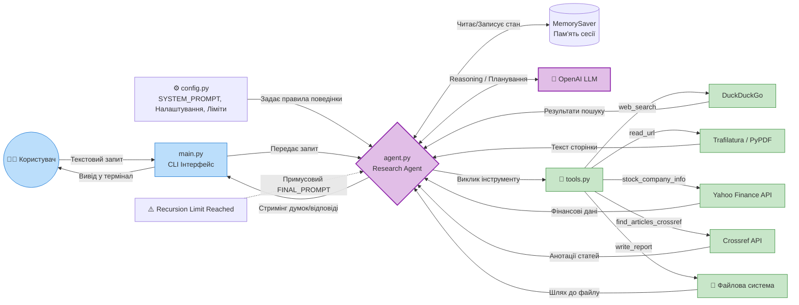

# Завдання: Research Agent з власним ReAct Loop


### Що змінилося порівняно з homework-lesson-3
| homework-lesson-3 | homework-lesson-4 |
|---|---|
| LangChain | Власна реалізація |
| `MemorySaver` для памʼяті | Список `messages` (для поточної сесії пам'ятає 50 останніх + перше повідомлення) |
| Памя'ять між різними сесіями відсутня | БД на SQLite з summary та повними логами попередніх розмов, для попередніх 5 розмов передаємо коротке summary з БД |
| `@tool` декоратор LangChain | Tools описані як JSON Schema для API |
| Базовий system prompt | Покращений prompt із застосуванням технік промптингу |
|-|Користувач може видалити збережені дані про попередні розмови (delete history)|

### Приклад:


Приклади згенерованих звітів - в [output](/homework-lesson-4/output)

### Загальний опис

Агент запускається з терміналу (python3 main.py) та працює в інтерактивному режимі — користувач вводить запитання, отримує відповідь, і може продовжити діалог.
Агент підтримує зв'язний діалог — пам'ятає попередні повідомлення в межах сесії.

Для коректної роботи потрібен [API-ключ OpenAI](https://platform.openai.com/) та створений файл .env з вказаним ключем: `OPENAI_API_KEY=<тут_ваш_ключ>`

Файл залежностей — [requirements.txt](https://github.com/viktor-taraba/MULTI-AGENT-SYSTEMS/blob/main/homework-lesson-3/requirements.txt), встановлення необхідних бібліотек `python3 -m pip install -r requirements.txt`

### Опис тулів для агента:
|Назва|Параметри|Опис|
|--|--|--|
|`web_search`|`query: str`|Шукає актуальну інформацію в інтернеті через DuckDuckGo. Повертає перелік знайдених посилань з даними про заголовок, URL, фрагмент тексту. Використовується як перший крок пошуку.|
|`read_url`|`url: str`|Отримує основний текст із вебсторінки (або PDF, якщо це пряме посилання на pdf-звіт чи статтю).|
|`stock_company_info`|`stock_ticker: str, result_type: str`|Отримує фінансові дані або загальний профіль компанії через Yahoo Finance API.|
|`find_articles_crossref`|`query: str`|Шукає наукові статті в базі Crossref. Повертає відфільтрований список записів із валідною анотацією (назва, анотація, DOI, рік).|
|`write_report`|`filename: str, content: str`|Зберігає фінальний звіт у форматі Markdown, використовується як останній крок для видачі результату.|

### Структура проєкту

```
homework-lesson-4/
├── main.py              # Entry point
├── agent.py             # Agent setup (LLM, tools, memory, create_agent)
├── tools.py             # Tool definitions and implementations
├── config.py            # System prompt, settings, constants
├── agent_memory.py      # SQLite database for cross-sesion memory and logging
├── requirements.txt     # Libraries list + min version for each library
├── output/
│   └── context_window_agentic_systems_comparison.md   # Example generated report (#1)
│   └── dividend_policy_literature.md                  # Example generated report (#2)
│   └── news_ukraine_last_week_14-21_Mar_2026.md       # Example generated report (#3)
│   └── superortikon_report.md                         # Example generated report (#4)
│   └── test_finans_2kurs.md                           # Example generated report (#5)
└── README.md            # Setup instructions, architecture overview
```

### Блок-схема роботи агента



---

Приклад логу в консолі:
```
You: Порівняй naive RAG та sentence-window retrieval

🔧 Tool call: web_search(query="naive RAG approach explained")
📎 Result: Found 5 results...

🔧 Tool call: web_search(query="sentence window retrieval RAG")
📎 Result: Found 5 results...

🔧 Tool call: read_url(url="https://example.com/rag-comparison")
📎 Result: [5000 chars] Article about RAG approaches...

🔧 Tool call: write_report(filename="rag_comparison.md", content="# RAG Comparison...")
📎 Result: Report saved to output/rag_comparison.md

Agent: Звіт збережено у output/rag_comparison.md. Ось основні відмінності: ...
```

---
