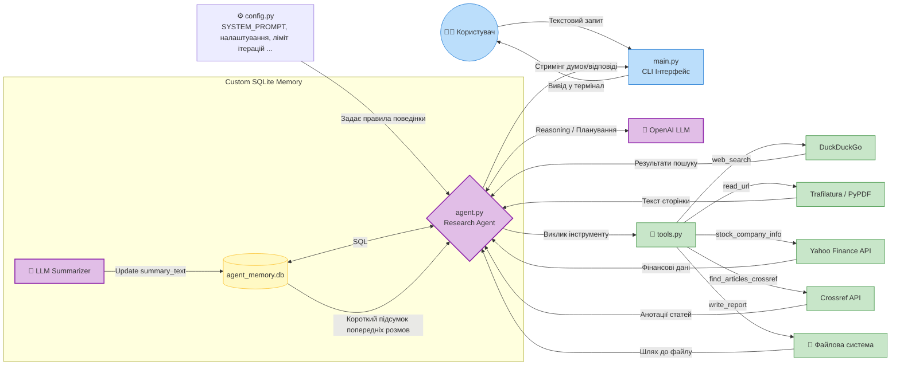
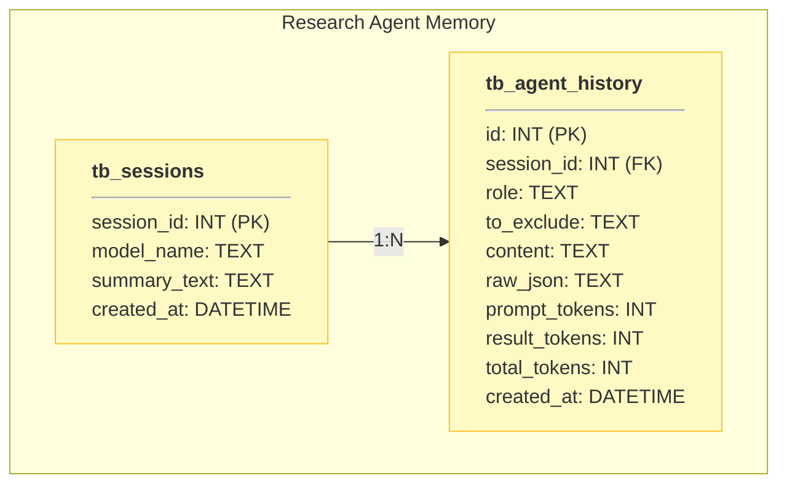

# Завдання: Research Agent з RAG-системою


### Що змінилося порівняно з homework-lesson-4

| Було (homework-lesson-4)                        | Стає (homework-lesson-5) |
|-------------------------------------------------|---|
| Tools: `web_search`, `read_url`, `write_report` | + новий tool: `knowledge_search` (працює на основі [retriever.py](/homework-lesson-5/retriever.py))|
| Агент шукає лише в інтернеті                    | Агент шукає і в інтернеті, і в локальній базі знань |
|                                                 | Є pipeline [ingest.py](/homework-lesson-5/ingest.py) для розбиття на чанки+ембедінги+завантаження та збереження документів у векторну БД (допустимі формати PDF, TXT, MD, субтитри з youtube відео, DOCX); з використанням хеш-функцій уникаємо дублювання даних при оновленні файлів, також підтримується видалення даних файлу за умови що його видалили з папки data|
|                                                 | Hybrid search (semantic + BM25) з cross-encoder reranking ([retriever.py](/homework-lesson-5/retriever.py))|

---


### Приклад:


Приклади згенерованих звітів - в [output](/homework-lesson-5/output)

### Загальний опис

Агент запускається з терміналу (python3 main.py) та працює в інтерактивному режимі — користувач вводить запитання, отримує відповідь, і може продовжити діалог.
Агент підтримує зв'язний діалог — пам'ятає попередні повідомлення в межах сесії.

Для коректної роботи потрібен [API-ключ OpenAI](https://platform.openai.com/) та аналогічно для [Hugging Face](https://huggingface.co/settings/tokens), має бути створений файл .env з вказаними ключами: `OPENAI_API_KEY=<тут_ваш_ключ>` та `HF_TOKEN=<тут_ваш_ключ>`

Файл залежностей — [requirements.txt](https://github.com/viktor-taraba/MULTI-AGENT-SYSTEMS-course/blob/main/homework-lesson-5/requirements.txt), встановлення необхідних бібліотек `python3 -m pip install -r requirements.txt`

При підрізці messages (лише для поточної розмови, для попередніх зберігаємо усі повідомлення та на їх основі робимо короткий підсумок) враховуємо послідовність ResponseReasoningItem -> ResponseFunctionToolCall -> function_call_output. Рекомендується задавати значення [max_steps_to_remember](/homework-lesson-5/config.py) з розрахунком на максимально можливу тривалість діалогу, тобто таким чином, щоб воно було не менше за 2+(max_iterations+1)*3 (перше повідомлення з системним повідомленням + запит користувача + максимальна кількість ітерацій + додаткова ітерація на формування звіту).

Приклад кроків при розрахунку к-ті повідомлень для пам'яті:
```
 ResponseReasoningItem(
        id="rs_01524c199f411aad0069bfe24771848191b6a8b30304df4eac",
        summary=[],
        type="reasoning",
        content=None,
        encrypted_content=None,
        status=None,
    ),
ResponseFunctionToolCall(
        arguments='{"query":"BERT 2018 arXiv \'BERT: Pre-training of Deep Bidirectional Transformers\' pdf"}',
        call_id="call_lZfO3ET79puJhldRPp5i2hy4",
        name="web_search",
        type="function_call",
        id="fc_01524c199f411aad0069bfe247bebc81918e38e7dddb7991d8",
        namespace=None,
        status="completed",
    ),
    {
        "type": "function_call_output",
        "call_id": "call_lZfO3ET79puJhldRPp5i2hy4",
        "output": '"[{\\"title\\": \\"[1810.04805] BERT: Pre-training of Deep Bidirectional\\", \\"url\\": \\"https://arxiv.org/abs/1810.04805\\", \\"snippet\\": \\"View aPDFofthe paper titledBERT:Pre-trainingofDeepBidirectionalTransformersfor Language Understanding, by Jacob Devlin and 3 other authors\\"}, {\\"title\\": \\"Toward structuring real-world data: Deep learning for\\", \\"url\\": \\"https://www.cell.com/patterns/fulltext/S2666-3899(23)00066-1\\", \\"snippet\\": \\"... in medical registries, which are often readily available and capture patient information, as the basis for patient-level supervision totraindeep...\\"}, {\\"title\\": \\"BERT (Language Model)\\", \\"url\\": \\"https://devopedia.org/bert-language-model\\", \\"snippet\\": \\"...pdfRedirected URLs: Discussion: https://arxiv.org/pdf/1810.04805.pdf\\\\u2192 http://arxiv.org/pdf/1810.04805 Discussion: ...\\"}, {\\"title\\": \\"Application and Effectiveness of BERT in Question and Answer\\", \\"url\\": \\"https://www.itm-conferences.org/articles/itmconf/ref/2025/04/itmconf_iwadi2024_02007/itmconf_iwadi2024_02007.html\\", \\"snippet\\": \\"Devlin,BERT:Pre-trainingofdeepbidirectionaltransformersfor language understanding. ...BidirectionalEncoder Representations fromTransformers...\\"}, {\\"title\\": \\"Chapter | Papers We Love\\", \\"url\\": \\"https://paperswelove.org/chapter/toronto/\\", \\"snippet\\": \\"Arun Raja will be presenting \\\\u201cBERT:Pre-trainingofDeepBidirectionalTransformersfor Language Understanding\\\\u201d by Jacob Devlin, et al.\\"}, {\\"title\\": \\"Themen\\", \\"url\\": \\"https://www.mnm-team.org/teaching/Seminare/2022ws/Hauptseminar/Themen.html\\", \\"snippet\\": \\"Devlin et al.,BERT:Pre-trainingofDeepBidirectionalTransformersfor Language Understanding , 2019 ... Latent Diffusion Models, https://arxiv...\\"}, {\\"title\\": \\"Themen\\", \\"url\\": \\"https://www.mnm-team.org/teaching/Seminare/2022ws/Hauptseminar/Themen/\\", \\"snippet\\": \\"Devlin et al.,BERT:Pre-trainingofDeepBidirectionalTransformersfor Language Understanding , 2019 ... Latent Diffusion Models, https://arxiv...\\"}]"',
    },
```

Підтримувані формати файлів для RAG (для збереження використовуєьтся Chroma):
- `PDF-файли (.pdf)` — спочатку намагаємося витягнути текст через `PyPDFLoader`. Якщо сторінки виявляються "порожніми" (наприклад, це скани або складний формат), використовуємо резервний `PyMuPDFLoader`.
- `Текстові файли (.txt)` — зчитуються як звичайний текст у кодуванні UTF-8 за допомогою `TextLoader`.
- `Markdown-файли (.md)` — також обробляються базовим TextLoader як звичайний текст.
- `Документи Microsoft Word (.docx)` — завантажуються за допомогою `Docx2txtLoader`
- `Субтитри YouTube-відео` — необхідний окремий файл `(.txt)` з переліком посилань (назва файлу задана у змінній `Youtube_links_file_name`), зчитаємо з нього посилання і отримуємо субтитри через `YoutubeLoader`, автоматично додаючи URL як джерело в метадані.

### Опис тулів для агента:
|Назва|Параметри|Опис|
|--|--|--|
|`web_search`|`query: str`|Шукає актуальну інформацію в інтернеті через DuckDuckGo. Повертає перелік знайдених посилань з даними про заголовок, URL, фрагмент тексту. Використовується як перший крок пошуку.|
|`read_url`|`url: str`|Отримує основний текст із вебсторінки (або PDF, якщо це пряме посилання на pdf-звіт чи статтю).|
|`stock_company_info`|`stock_ticker: str, result_type: str`|Отримує фінансові дані або загальний профіль компанії через Yahoo Finance API.|
|`find_articles_crossref`|`query: str`|Шукає наукові статті в базі Crossref. Повертає відфільтрований список записів із валідною анотацією (назва, анотація, DOI, рік).|
|`knowledge_search`|query: str|Пошук у локальній базі знань за допомогою гібридного пошуку (hybrid retrieval) та реранкінгу.|
|`write_report`|`filename: str, content: str`|Зберігає фінальний звіт у форматі Markdown, використовується як останній крок для видачі результату.|

### Структура проєкту

```
homework-lesson-4/
├── main.py              # Entry point
├── agent.py             # Agent setup (LLM, tools, memory, create_agent)
├── tools.py             # Tool definitions and implementations
├── retriever.py         # Hybrid retrieval + reranking logic
├── ingest.py            # Ingestion pipeline: docs → chunks → embeddings → vector DB
├── config.py            # System prompt, settings, constants
├── agent_memory.db      # SQLite database for cross-sesion memory and logging
├── requirements.txt     # Libraries list + min version for each library
├── output/
│   └── dax_functions_intro.md            # Example generated report (#1)
│   └── agentic_development_power_bi.md   # Example generated report (#2)
│   └── RAG_and_retrieval_approaches.md   # Example generated report (#3)
├── data/                # Документи для ingestion
│   └── Tips and tricks for creating reports in Power BI Desktop.docx
│   └── Youtube_links.txt                 #перелік посилань на відео для завантаження субтитрів
│   └── PBIR Format Reference.md
│   └── Power BI Report Design.md
│   └── DAX COUNT.pdf
│   └── DAX AVERAGEX.pdf
│   └── DAX AVERAGEA.pdf
│   └── DAX AVERAGE.pdf
│   └── powerbi-intro.pdf
│   └── introducing-calendar-based-time-intelligence-in-dax.pdf
│   └── ai-and-agentic-development-for-business-intelligence.pdf
│   └── langchain.pdf
│   └── large-language-model.pdf
│   └── retrieval-augmented-generation.pdf
└── README.md            # Setup instructions, architecture overview
```

### Блок-схема роботи агента



### Схема даних (SQLite)




### Структура проекту

```
homework-lesson-5/
├── main.py              # Entry point (з homework-lesson-3/4, адаптований)
├── agent.py             # Agent setup з новим knowledge_search tool
├── tools.py             # web_search, read_url, write_report, knowledge_search
├── retriever.py         # Hybrid retrieval + reranking logic
├── ingest.py            # Ingestion pipeline: docs → chunks → embeddings → vector DB
├── config.py            # Settings
├── requirements.txt     # Залежності
├── data/                # Документи для ingestion
│   └── (ваші PDF/TXT файли)
└── .env                 # API ключі (не комітити!)
```

---

Приклад логу в консолі:
```
Research Agent
type 'exit' or 'quit' to quit
'delete history' to delete full conversation history (including previous conversations) and exit
----------------------------------------------------------------------------------------------------

You: Що таке RAG і які є підходи до retrieval?

🔄 Iteration 1 - Thinking...
🔧 Tool called -> knowledge_search({'query': 'RAG retrieval augmentation generation approaches retrieval types'})
✅ Result (knowledge_search): --- Document 1 ---
Source: retrieval-augmented-generation.pdf (Page: 0)
Content:
Retrieval-augmented...

🔄 Iteration 2 - Thinking...
🔧 Tool called -> web_search({'query': 'Retrieval-augmented generation RAG approaches to retrieval vector dense sparse BM25 hybri...)
✅ Result (web_search): [{"title": "Retrieval-augmented generation - Wikipedia", "url": "https://en.wikipedia.org/wiki/Retri...

🔄 Iteration 3 - Thinking...
🔧 Tool called -> read_url({'url': 'https://en.wikipedia.org/wiki/Retrieval-augmented_generation'})
✅ Result (read_url): Retrieval-augmented generation
Retrieval-augmented generation (RAG) is a technique that enables larg...

🔄 Iteration 4 - Thinking...
🔧 Tool called -> read_url({'url': 'https://medium.com/@yashwanths_29644/retrieval-augmented-generation-rag-06-bm25-retriever-w...)
✅ Result (read_url): Error: Unable to fetch content from 'https://medium.com/@yashwanths_29644/retrieval-augmented-genera...

🔄 Iteration 5 - Thinking...
🔧 Tool called -> read_url({'url': 'https://watercrawl.dev/blog/Building-on-RAG'})
✅ Result (read_url): 🎬 Episode 2 : 🔍 Building on RAG: Exploring BM25 and Semantic Search
Ai engineer
Retrieval-Augmented ...

🔄 Iteration 6 - Thinking...
🔧 Tool called -> write_report({'filename': 'RAG_and_retrieval_approaches.md', 'content': '# RAG (Retrieval‑Augmented Generation) —...)
✅ Result (write_report): Success: Report successfully saved to C:\Users\Viktor\source\repos\MULTI-AGENT-SYSTEMS-course\homewo...

🔄 Iteration 7 - Thinking...

🤖 Agent:
Звіт успішно збережено як RAG_and_retrieval_approaches.md. Коротко: RAG — це поєднання LLM і механізму витягування зовнішніх документів для підвищення актуальності й точності відповідей; основні підходи до retrieval — sparse (BM25), dense (embedding‑based), hybrid (sparse+dense), а також neural retrievers із поділом на bi‑encoder і cross‑encoder та reranking. Документ містить рекомендації, архітектурний приклад, метрики оцінки й посилання на джерела.
```
